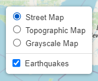
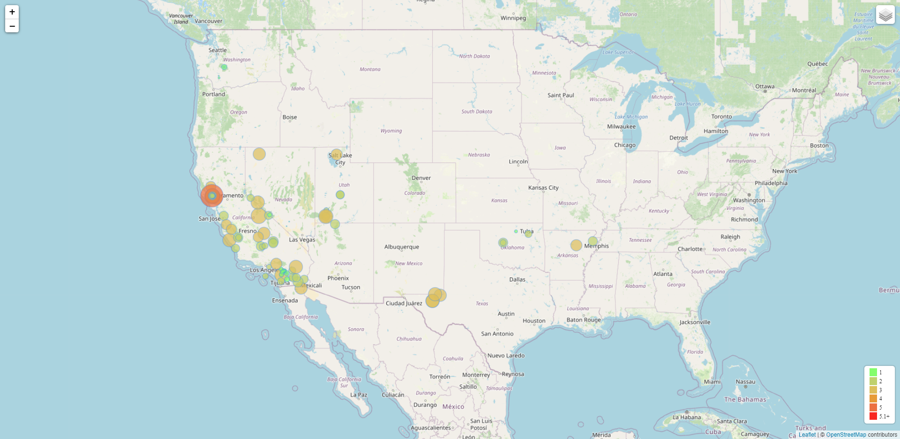
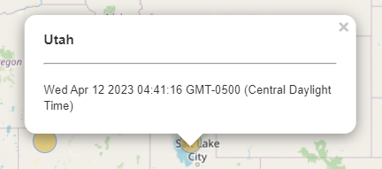
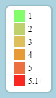

# Earthquake Visualization
## leaflet-challenge

1. Your first task is to visualize an earthquake dataset. Complete the following steps:
    * Get your dataset. To do so, follow these steps:
        * The USGS provides earthquake data in a number of different formats, updated every 5 minutes. Visit the [USGS GeoJSON FeedLinks](https://earthquake.usgs.gov/earthquakes/feed/v1.0/geojson.php) page and choose a dataset to visualize.
  In this challenge all the earhquakes in the past day were selected you can find the GeoJSON data [here](https://earthquake.usgs.gov/earthquakes/feed/v1.0/summary/all_day.geojson).

  

2. Import and visualize the data by doing the following:
    * Using Leaflet, create a map that plots all the earthquakes from your dataset based on their longitude and latitude.

    * Your data markers should reflect the magnitude of the earthquake by their size and the depth of the earthquake by color. Earthquakes with higher magnitudes should appear larger, and earthquakes with greater depth should appear darker in color.

        Hint: The depth of the earth can be found as the third coordinate for each earthquake.

    
    

    * Include popups that provide additional information about the earthquake when its associated marker is clicked.

    

    * Create a legend that will provide context for your map data.

    

[FINAL HTML VIEW](https://candidamg.github.io/leaflet-challenge/)
